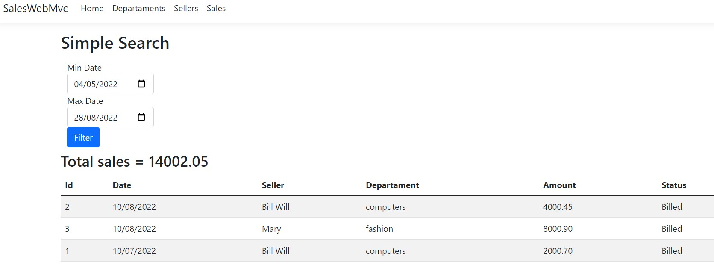

# Sales Web

<p align="center">
    <a href="#aplicação-para-gerenciamento-de-vendas">Aplicação</a>&nbsp;&nbsp;|&nbsp;&nbsp;
    <a href="#-tecnologias-e-frameworks">Tecnologias e Frameworks</a>&nbsp;&nbsp;|&nbsp;&nbsp;
    <a href="#pré-requisitos">Pré-requisitos</a>&nbsp;&nbsp;|&nbsp;&nbsp;
    <a href="#executando-a-aplicação">Executando a aplicação</a>&nbsp;&nbsp;|&nbsp;&nbsp;
    <a href="#features">Features</a>&nbsp;&nbsp;|&nbsp;&nbsp;
    <a href="#-autor">Autor</a>&nbsp;&nbsp;|&nbsp;&nbsp;
    <a href="#-licença">Licença</a>
</p>



### Aplicação para gerenciamento de vendas

O objetivo do projeto é aplicar os conceitos de MVC com utilização do recurso Razor Pages no ASP.NET

## 🛠 Tecnologias e Frameworks
- [.NET 6](https://visualstudio.microsoft.com/pt-br/vs/community/)
- [EntityFrameworkCore](https://www.entityframeworktutorial.net/efcore/entity-framework-core.aspx)
- [Razor Pages](https://docs.microsoft.com/pt-br/aspnet/core/razor-pages/?view=aspnetcore-6.0&tabs=visual-studio)

## Pré-requisitos
- Visual Studio versão 17.0 ou superior de 2022 para compilação e execução do back-end - [VisualStudio](https://visualstudio.microsoft.com/pt-br/vs/community/)
- Banco de dados Microsoft SQLServer - [SQLServer](https://www.microsoft.com/pt-br/sql-server/sql-server-downloads)

## Executando a aplicação
```bash
# Clone este repositório ou faça o download .zip e extraia os arquivos
$ git clone <https://github.com/GuilhermeAFerrari/Sales-Web.git>

# Acesse a pasta Sales-Web do projeto e abra o arquvio src/SalesWebMvc.sln com o Visual Studio

# Abra o arquivo appsetting.json e configure sua string de conexao com o banco de dados adicionando ou editando valores na chave "ConnectionStrings"

# No console do gerenciador de pacotes execute o comando para executar as migrations
$ dotnet ef database update

# Execute a aplicação (CRTL+F5)
```

## Features
- Gerenciamento de Departamentos
- Gerenciamento de Vendedores
- Gerenciamento de Vendas

## 😎 Autor
- Guilherme Ferrari
- E-mail: guile.ferrari@hotmail.com
- [](https://www.linkedin.com/in/guilherme-antonio-ferrari/)

## 📝 Licença
MIT.